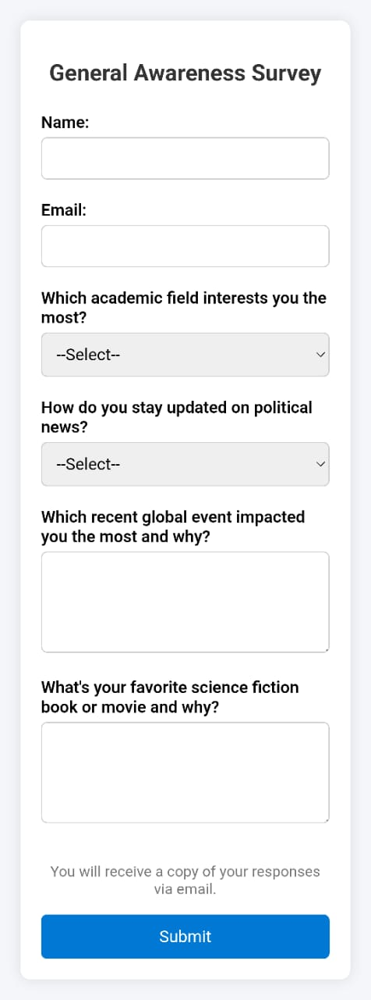
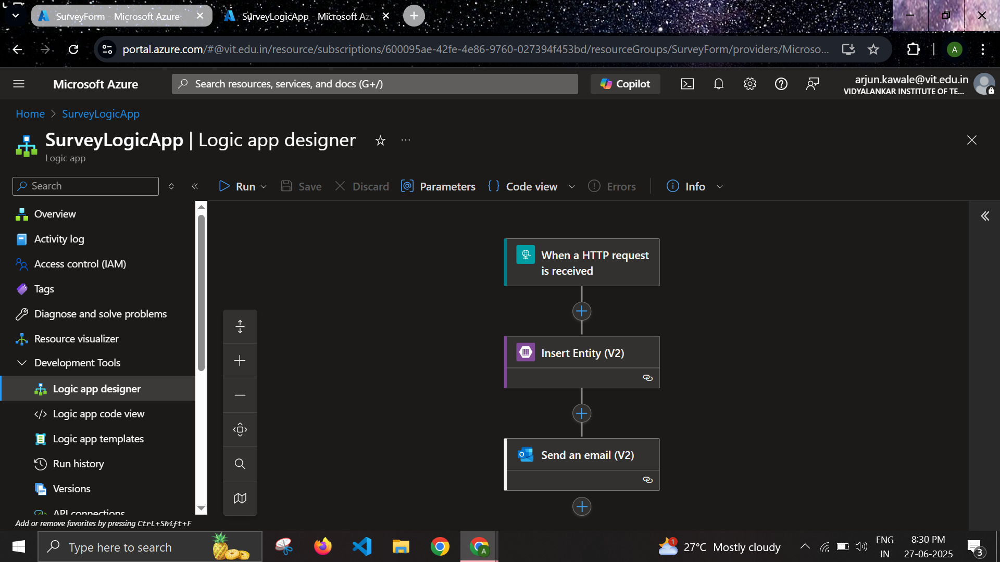
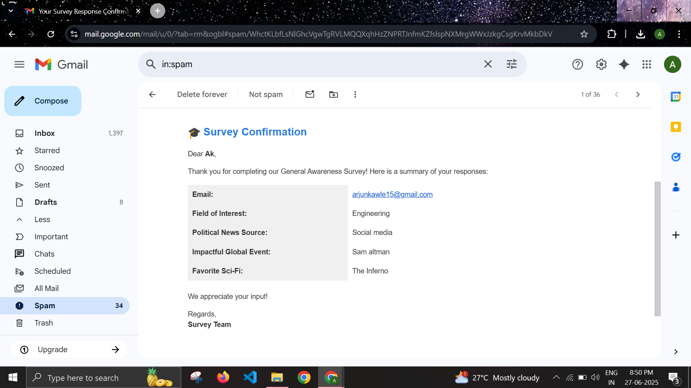
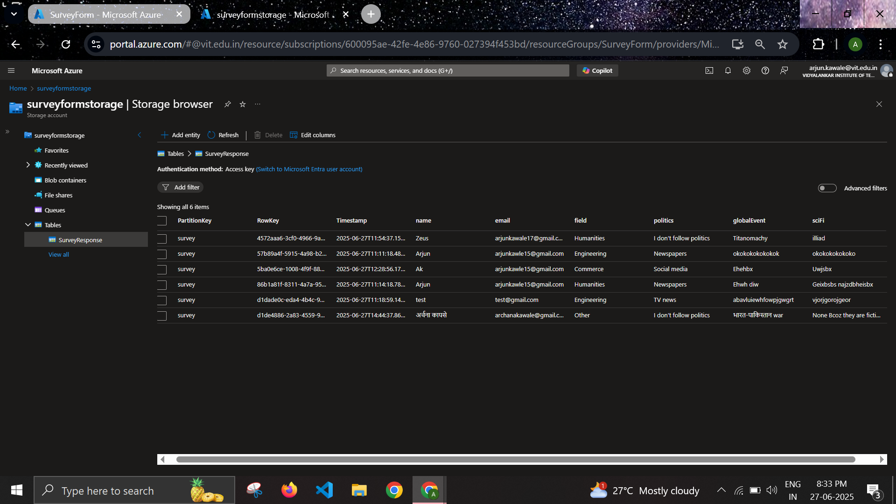
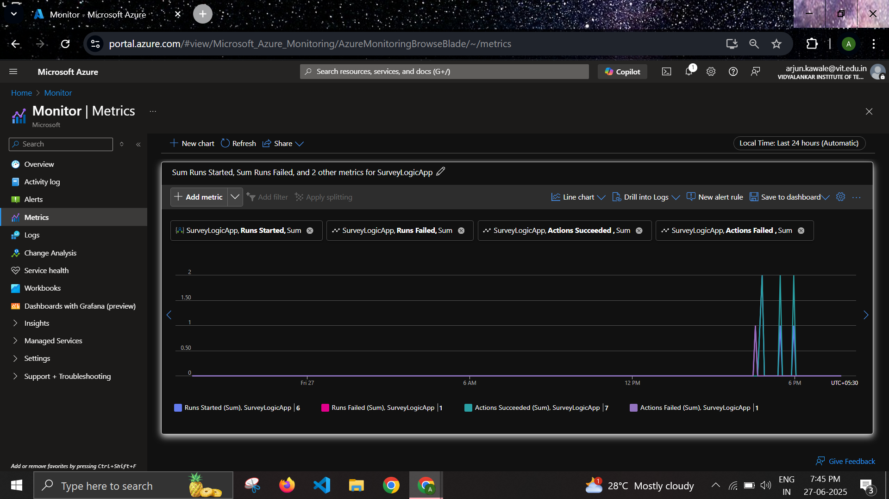
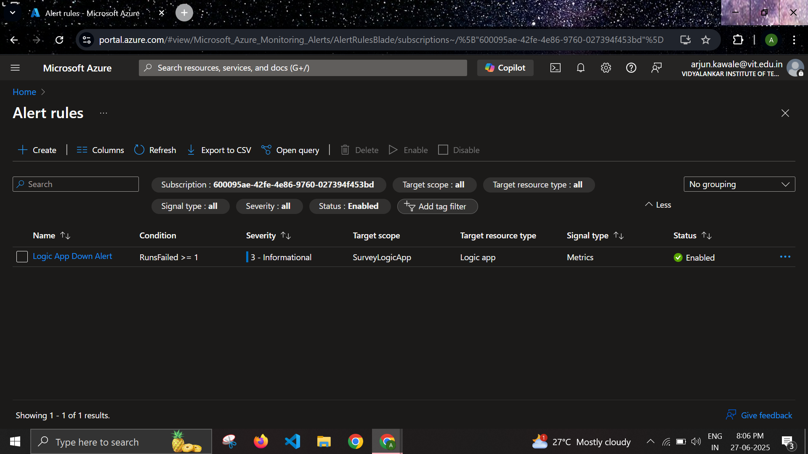
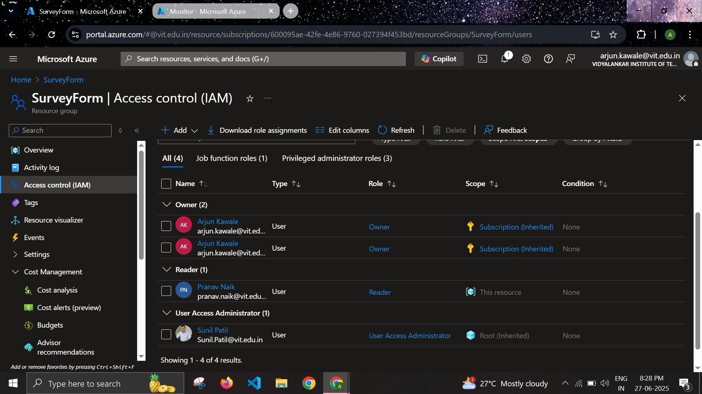

# ☁️ Azure-Powered Survey Project

🔗 **Live Demo:** [Visit the form](https://proud-plant-01239391e.2.azurestaticapps.net/)

📎 **Direct Link:** https://proud-plant-01239391e.2.azurestaticapps.net/

This project demonstrates a fully cloud-integrated feedback form using **5 Azure services**, focused on simplicity, automation, and observability.

## 🚀 Services Used

1. **Azure Static Web Apps**  
   Hosts the frontend HTML/CSS form. Users can submit survey responses through this static site.

   

2. **Azure Logic Apps**  
   Processes incoming form data via an HTTP trigger. Logic Apps perform two main actions:
   - Store data into **Azure Table Storage**
   - Send a confirmation email to the user

   - **Logic App Workflow:**
     

   - **Confirmation Email Sent to User:**
     

3. **Azure Table Storage**  
   Stores all form responses (name, email, feedback) in structured format.

   

4. **Azure Monitor & Alerts**  
   Monitors Logic Apps' health. If the Logic App fails or stops, Azure Monitor tracks the issue and sends alerts.

   - **Monitor Activity Logs:** Overview of Logic App executions, errors, and performance.  
     

   - **Alert Rule Setup:** Custom rule to send alerts via email if Logic App fails.  
     

5. **Azure IAM (Role-Based Access Control)**  
   A **Reader Role** was created for an external user to view (not modify) form submissions for analysis.

   

---

## 🔁 Flow Summary

1. User fills the form hosted on **Azure Static Web Apps**.
2. Submission triggers **Azure Logic App**.
3. Logic App writes data to **Azure Table Storage** and sends a confirmation email.
4. **Azure Monitor** watches the Logic App. Alerts are triggered on failure.
5. An IAM-assigned reader can review the collected data.

---

## 📸 Screenshot Proof

All actions are backed with screenshots above. All code and setup are publicly available in this repository.

> 🔁 _“If it’s not in the repo, it didn’t happen.”_

---

## 📌 How to Run

To try the system:
- Visit the live [form website](https://proud-plant-01239391e.2.azurestaticapps.net/)
- Or open the full link directly:  
  **https://proud-plant-01239391e.2.azurestaticapps.net/**
- Fill out the form
- Check your email for a confirmation message(checkout the spam folder as well!)

---

## ✅ Summary

This project is a **survey form sample** that integrates **5 Azure cloud services** in a connected workflow:

- Static Web App
- Logic App
- Table Storage
- Monitor
- IAM

It demonstrates automation, data handling, and monitoring in a cloud-native environment and satisfies the requirement of using 4+ Azure services.

